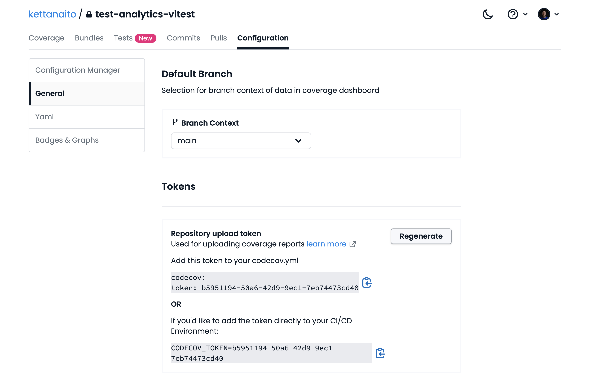

# Test Analytics in Vitest

Example project of using [Test Analytics from Codecov](https://docs.codecov.com/docs/test-analytics) with [Vitest Browser Mode](https://vitest.dev/guide/browser/).

## Getting started

### 1. Configure Vitest

In `vitest.config.ts`, make sure to add `juint` to the list of test `reporters` and provide the `outputFile` option to emit the report to the file system:

```js
// vitest.config.ts
import { defineConfig } from 'vitest/config'

export default defineConfig({
  test: {
    // ...other options
    reporters: ['default', 'junit'],
    outputFile: './test-report.junit.xml',
  },
})
```

> See full [`vitest.config.ts`](./vitest.config.ts) for reference.

### 2. Install Codecov GitHub app

Click [here](https://github.com/apps/codecov/installations/select_target) to install the Codecov GitHub app in your project.

### 3. Upload test report

Create a GitHub Actions workflow that will continuously run your tests and upload the test report to Codecov. Here's an example workflow:

```yml
# .github/workflows/ci.yml
jobs:
  test:
    runs-on: ubuntu-latest
    steps:
      # ...other steps

      - name: Upload test results
        if: ${{ !cancelled() }}
        uses: codecov/test-results-action@v1
        with:
          token: ${{ secrets.CODECOV_TOKEN }}
```

> See full [`ci.yml` workflow](./.github/workflows/ci.yml) for reference.

Use the "Repository upload token" as the value for the `CODECOV_TOKEN` environment variable. You can find that value in the "Configuration > General" section of your project on Codecov:



Put that value as a new secret for GitHub Actions by going to your GitHub repository, "Settings > Secrets and variables > Actions" and click the "New repository secret" button.

## Resources

- [**Test Analytics documentation**](https://docs.codecov.com/docs/test-analytics)
- [Find failing and flaky tests with Codecov Test Analytics](https://about.codecov.io/blog/find-failing-and-flaky-tests-with-codecov-test-analytics/)
- [Be S.M.A.R.T. About Flaky Tests](https://www.epicweb.dev/be-smart-about-flaky-tests)
